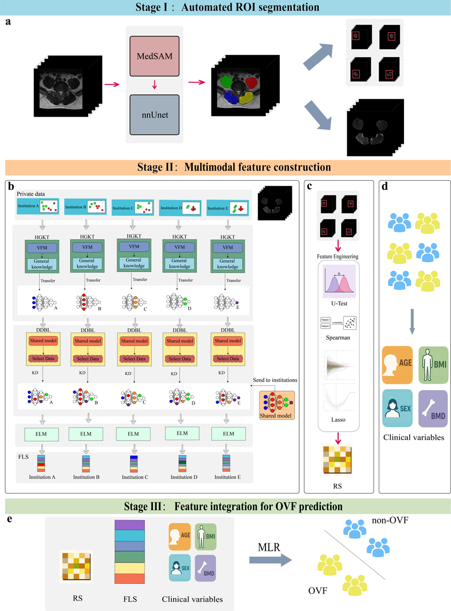

# Osteoporosis-FedVFM


In this study, we used the DINOv2 series vision foundation model combined with Federated Learning on an Ubuntu system for experiments. Below is a simple demo guide:

1、Multi-center Data Download

```
The multi-center Osteoporosis dataset used in this study is available upon reasonable request. If you need to access or download the data, please contact the corresponding author via email.

```

2、Pre-trained Weights for the Vision Foundation Model

```
The compressed package includes a DINOv2 model parameter.
More model weight files can be downloaded from the following website:
[https://github.com/facebookresearch/dinov2](https://github.com/facebookresearch/dinov2)

```

3、Unzip the downloaded multi-center data and place it in the corresponding dataset folder.

4、Install and Activate the Runtime Environment (Anaconda) and Install Dependencies:

```
wget [https://repo.anaconda.com/archive/Anaconda3-2023.03-Linux-x86_64.sh](https://repo.anaconda.com/archive/Anaconda3-2023.03-Linux-x86_64.sh)
bash Anaconda3-2023.03-Linux-x86_64.sh
source ~/.bashrc
conda create --name fed_env python=3.9
conda activate fed_env
cd ./fed_llm
pip install -r requirements.txt

```

5、Run demo:

```
# for feature extraction:
python feature_extraction2.py

# for federated learning model training (N-clients):
python FL_LLM_Nclients_main.py

```

To facilitate your reading, we have added necessary code comments in the scripts. We have also preset the hyperparameters for model training, allowing you to run the demo directly. If you wish to set your own hyperparameters, you can do so according to the parameter descriptions.
If you want to shorten the model training time, and if CPU and GPU resources allow, you can set a larger batch_size or adjust the num_workers quantity in the data dataloader scripts (such as `N_data_dataloaders.py`). Conversely, you can reduce the batch_size and num_works to free up more computing resources.

6、Output:

```
Model files and extracted features will be saved in the corresponding output directories.

```

7、Model Evaluation and Radiomics Analysis:

```
# for XGBoost model evaluation:
cd ../Radiomics
python XGBoostEval.py

# for Multiple Linear Regression (MLR) evaluation:
python MLREval.py

```

The trained model parameters mentioned in the paper are saved in the project folder. If you wish to reproduce the results in the paper, you can use these scripts to load the model weights and data for validation. We conduct all statistical analyses and feature selection utilizing standard Python libraries to ensure maximum reproducibility and academic rigorousness across different computational environments.

Thank you for your attention!
